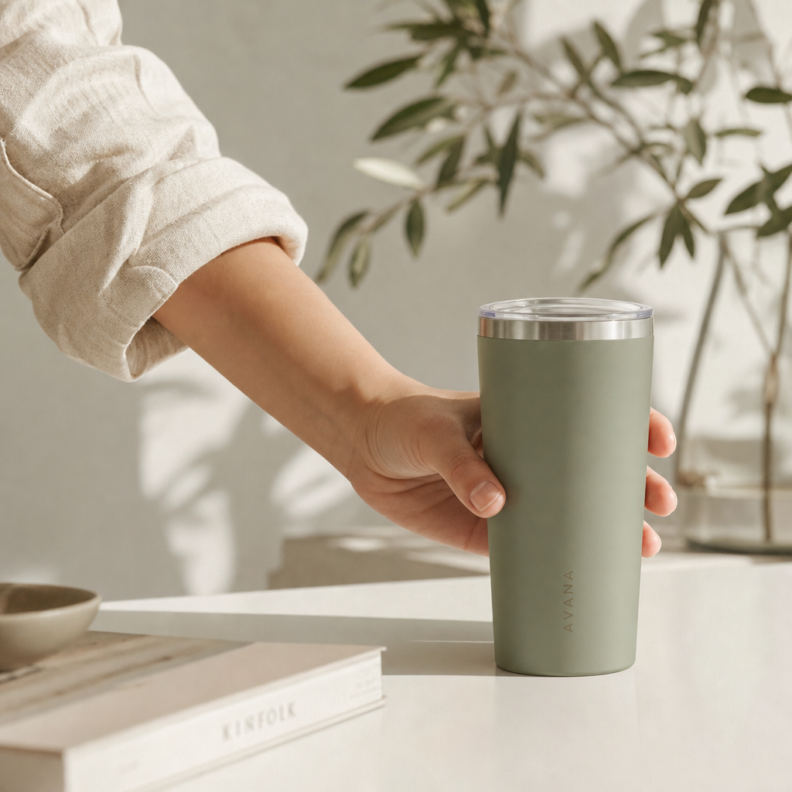
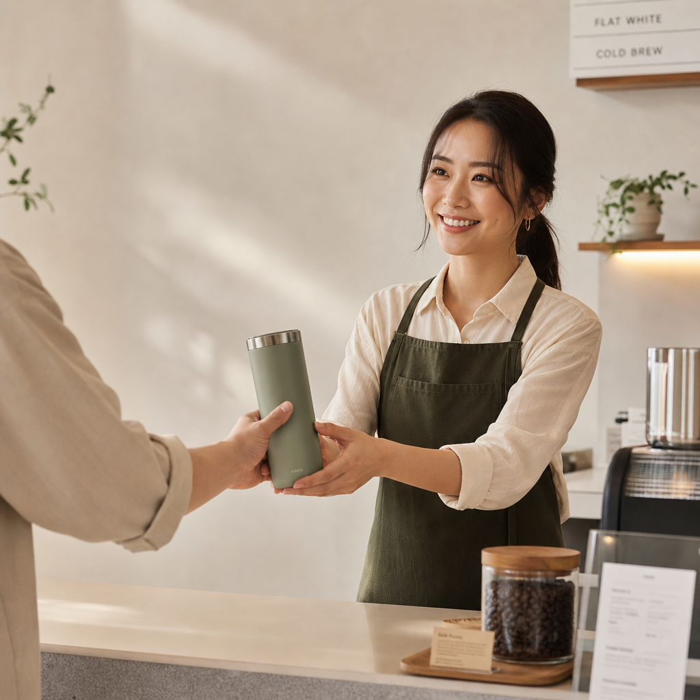
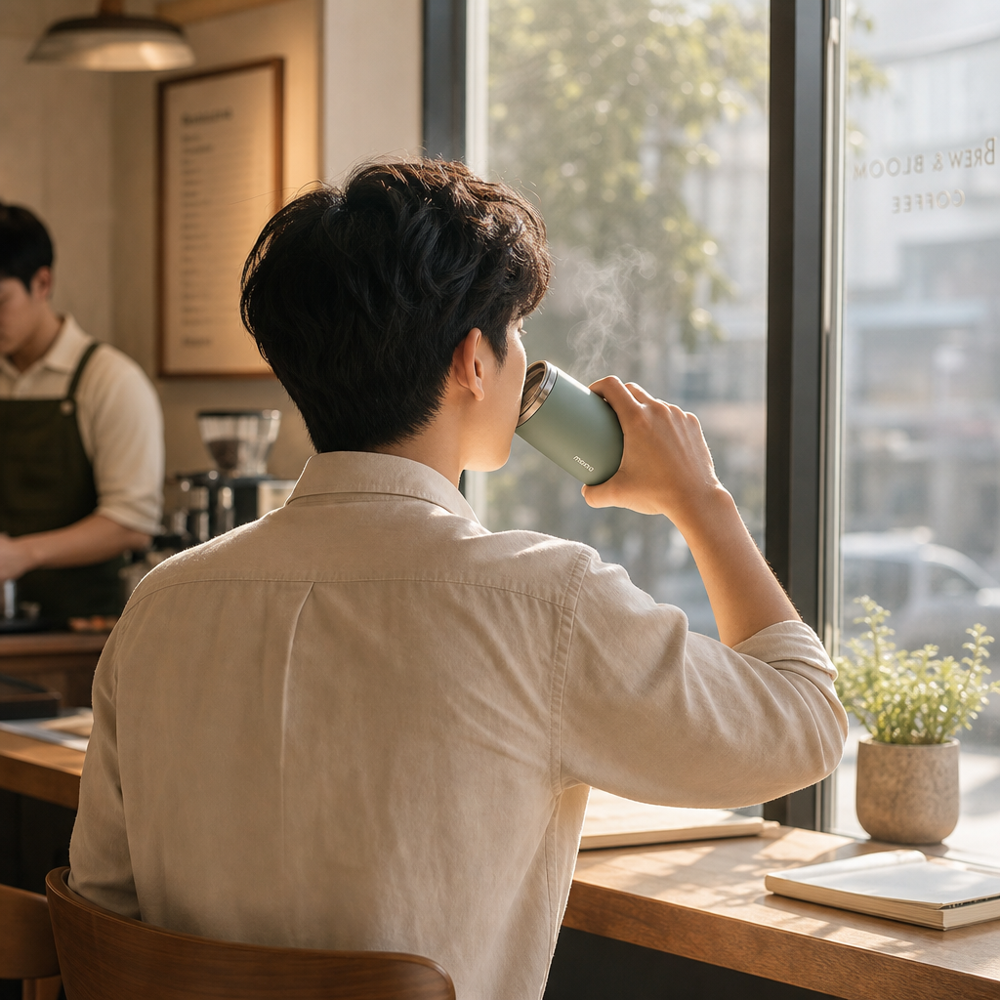
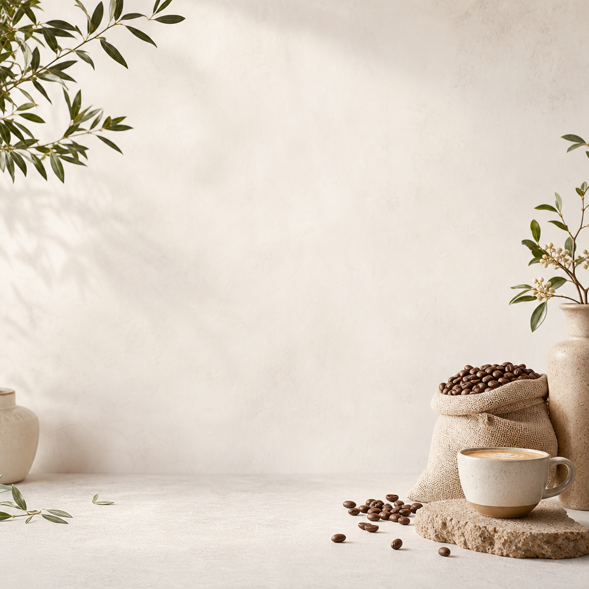

# B1-2 멀티모달 콘텐츠 제작
## 스토리보드  
 **1. 브랜드 아이덴티티**

   + **브랜드명:** Root Coffee
   + **타    겟:** 2-30대(Minimal/Trendy)
   + **톤앤매너:** Green, Cozy, Calm, Sustainable
   + **U  S  P:** 텀블러 사용을 자연스러운 일상으로 만드는 카페
   + **핵심 메시지:** "좋은 습관은 매일의 한 잔에서 시작됩니다."
   + **광고의 목적:** 인지/브랜드가 가진 친환경적 가치와 '텀블러 사용을 일상화하는 카페'라는 차별점을 알린다. '텀블러 할인'을 제시하여 고객이 직접 참여하고 행동으로 옮기도록 이끈다.

 **2. 씬 구성**  

+ **씬 1**  
  - 씬 길이: 2초  
  - 목표 메시지: "좋은 습관은 매일의 한 잔에서 시작됩니다."  
  - 화면 구성: 텀블러를 집고 있는 손/자막  
  - 사용 도구 및 목적  
\- 이미지 생성: GPT Image 2 (키 비주얼 생성)  
    
  - 입력 프롬프트:  
  A close-up of a hand reaching for and gently picking up a minimalist sage green stainless steel tumbler on a clean table, only the protagonist’s rolled-up light beige cotton shirt sleeve visible, soft natural morning light, minimal composition, calm and trendy lifestyle aesthetic, clean background, subtle shadows, premium editorial coffee ad style, cinematic framing, high detail. Keep the tumbler design, color, and material consistent across shots. Keep the protagonist’s shirt identical across shots. Continuity note: Use the same minimalist sage green stainless steel tumbler in all relevant shots. The protagonist wears the same clean light beige cotton shirt with rolled-up sleeves throughout the storyboard. The café employee must wear a clearly different outfit: a dark olive apron over a soft cream shirt.  
  - 출력 결과 요약: 화이트우드, 그린, 포근하고 따뜻한 느낌이 드는 키 비주얼 확보  
  - 결과 파일명: cut1.png  
    
+ **씬 2**  
  - 씬 길이: 2초  
  - 목표 메시지: "텀블러는 지속 가능한 선택입니다."  
  - 화면 구성: 텀블러를 건네 받는 인물/자막  
  - 사용 도구 및 목적  
 \- 이미지 생성: GPT Image 2 (키 비주얼 생성)  
     
  - 입력 프롬프트:  
  A clean café counter scene where the protagonist hands over the same minimalist sage green stainless steel tumbler, the protagonist’s rolled-up light beige cotton shirt sleeve visible in the foreground, and a café employee receiving it with both hands, the employee wearing a dark olive apron over a soft cream shirt, clearly different from the protagonist’s outfit, warm and polite interaction, minimal modern café interior, soft morning light, trendy and refined commercial style, clean composition with negative space for text, cinematic realism, high detail. Keep the tumbler design, color, and material consistent across shots. Do not dress the café employee in the same outfit as the protagonist.  
  - 출력 결과 요약: 화이트우드, 그린, 직업 특징이 강한 키 비주얼 확보  
  - 결과 파일명: cut2.png  
 
+ **씬 3**  
  - 씬 길이: 2초  
  - 목표 메시지: "좋은 습관은 편안한 일상이 됩니다."  
  - 화면 구성: 창가에서 커피를 마시는 인물  
  - 사용 도구 및 목적  
 \-이미지 생성: GPT Image 2 (키 비주얼 생성)  
    
 \-비디오 생성: OpenAI Sora 2  
  [시연 영상 보기](images/cut3-video.mp4)  
  - 입력 프롬프트:  
 \-이미지: A young office worker sitting by a bright café window, calmly enjoying coffee from the same minimalist sage green stainless steel tumbler, wearing the same light beige cotton shirt with rolled-up sleeves as in the earlier shots, soft sunlight falling across the table and face, quiet and cozy atmosphere, minimal and stylish composition, modern sustainable lifestyle mood, clean tones, gentle highlights, premium café advertisement aesthetic, cinematic and natural, high detail. Keep the tumbler design, color, and material consistent across shots. Keep the protagonist’s shirt identical across shots.  
 \-비디오: A realistic cafe commercial shot. A man in his late 20s to early 30s sits at a window-side table in a bright white wood cafe, seen from behind only. He wears a soft white-beige shirt with sleeves rolled to the forearms. He raises a handleless matte pale sage green stainless steel travel tumbler with straight cylindrical sides and a lid to his lips, about to sip through a visible open sip opening in the lid. Medium rear shot showing his upper body, the table, and the window area. Warm daylight, soft shadows, calm premium mood, static camera. The only drinking vessel visible is this tumbler. Do not show his face. Not an extreme close-up. Never show a mug, ceramic cup, glass, or paper cup. Do not add a handle. Do not change the tumbler’s shape or color. Do not show the lid fully closed.  
  - 출력 결과 요약: 화이트우드, 그린, 지시한 인물 실루엣 출력  
  - 결과 파일명: cut3.png/cut3-video.mp4  
 
+ **씬 3 프롬프트 개선 로그(요약)**
  - 수정 전 의도: '텀블러'를 들고 있는 남자가 창밖을 보며 '텀블러에 담긴 커피'를 마시는 장면  
  - 문제1: 텀블러가 머그컵으로 변경/문제2: 뚜껑이 닫힌 텀블러를 들고 마시는 장면  
  - 수정 후 변경: 스테인리스 텀블러 모양·형태·색 고정/머그컵·플라스틱컵·유리컵 변경 금지/마시는 장면이 아닌 입가로 들어올리는 장면으로 프롬프트 조정  
  - 결과 변화: 원하는 모양·형태·색의 텀블러를 입가로 들어올리는 장면 출력  
 
+ **씬 4**  
  - 씬 길이: 3초  
  - 목표 메시지: "Root Coffee와 함께 좋은 습관을 이어가 주세요."  
  - 화면 구성: 로고·슬로건  
  - 사용 도구 및 목적  
 \-이미지 생성: GPT Image 2 (배경 생성)  
    
  - 입력 프롬프트:  
  A bright, minimal background for a coffee brand end card, soft natural light, clean neutral surface with subtle warm tones, modern sustainable lifestyle mood, elegant empty composition with generous negative space for a logo and slogan, refined and trendy commercial aesthetic, calm premium café branding style, minimal shadows, cinematic simplicity, high detail.  
  - 출력 결과 요약: 따뜻하고 포근한 느낌이 드는 배경  
  - 결과 파일명: cut4.png  
 
 **3. 보너스 과제**  

  + 동일 스토리 보드, 다른 도구로 재제작  
    - 비디오 생성: hailuoai (이미지를 비디오로 변환)  
   \-입력 프롬프트1: 카페에서 직원에게 텀블러를 건네주는 손님, 따뜻한 색감, 인물 중심보다는 분위기 중심  
   \-입력 프롬프트2: 카페에서 여유를 즐기며 텀블러에 담긴 커피를 마시는 손님, 은은하게 나타나는 Root Coffee 로고가 적힌 배경  
    - 오디오 생성: GPT-4o Mini TTS (내레이션 제작)  

- - - 

## 광고 영상 파일  

 + **최종 광고 영상**  

   [최종 광고 영상](images/RootCoffee-Branding-Video.mp4)  

   \-파일명: RootCoffee-Branding-Video.mp4  
   \-길이: 10초  
   \-해상도: 1080x1080  
   \-프레임레이트: 29fps  

 + **보너스 광고 영상**

   [보너스 광고 영상](images/RootCoffee-Bonus-Video.mp4)  

   \-파일명: RootCoffee-Bonus-Video.mp4  
   \-길이: 13초  
   \-해상도: 1920x1080  
   \-프레임레이트: 29fps  
 
